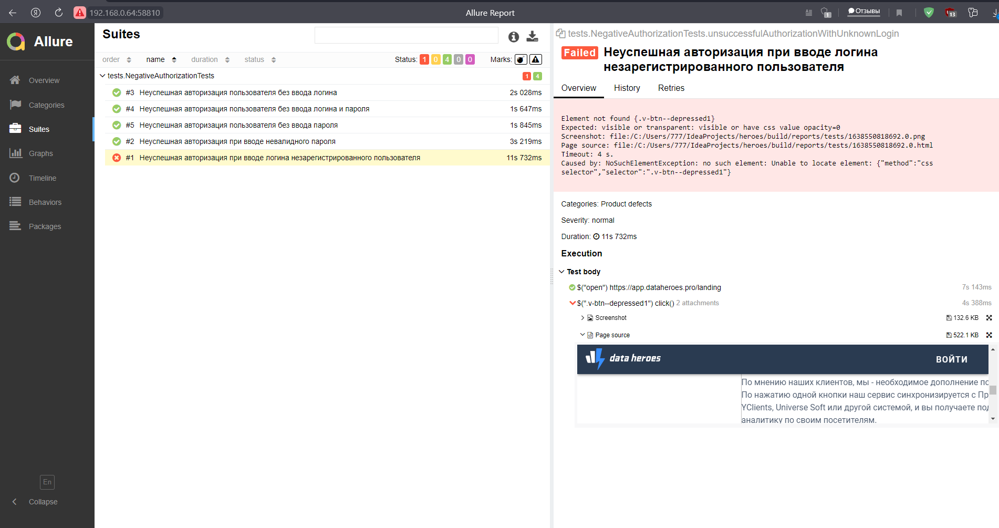

# AllureReports

  

https://t.me/allure_ru

### Подключаем Listener

Зависимость в build.gradle:

`````'io.qameta.allure:allure-selenide:2.16.1'`````


Код для теста:

`````SelenideLogger.addListener("allure", new AllureSelenide());`````


Получаем 2 attachments упавшего теста (Screenshot, Page source)



